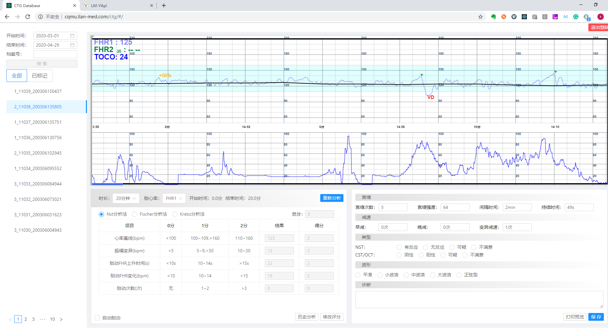
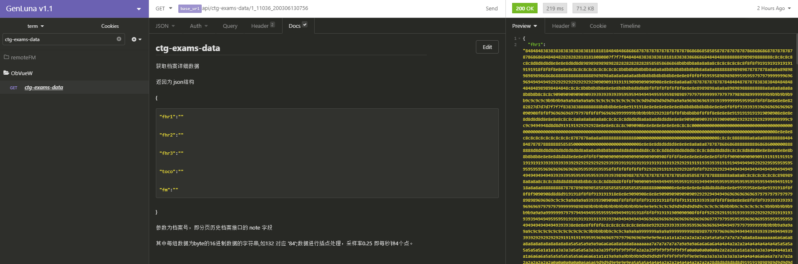
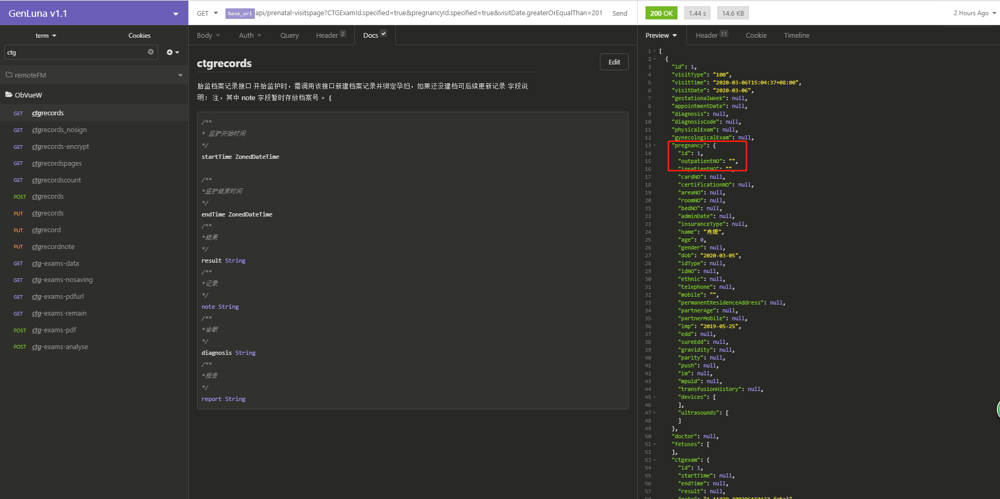

<h1 align="center">CTG Database</h1>


## 1.CTG数据查看

### web访问地址

```bash
地址： http://cqmu.lian-med.com/ctg/  
账号/密码：admin admin
```
<p align="center">

</p>
    
### 功能说明
>档案查询、CTG曲线查看、经典分析评分、数据标记等功能
    
    备注：基于用户隐私，系统没有直接展示孕产妇相关信息（接口包含）
    

## 2.数据接口访问

### 根据档案号获取CTG数据
<p align="center">

</p>
### 分页获取档案列表（包含用户信息）
<p align="center">

</p>
> 根据条件查询总条数
> 分页查询记录 （详见接口风格）
### 接口授权

### 接口风格

## 3.其他接口功能
### 围产保健接口
>支持孕妇常规产检信息、高危信息、分娩信息、新生儿等信息增删查改接口
### 临床事件
>支持事件记录接口
### 其他接口
>ESB与第三方信息系统对接

### 链接
1.[CTG-cqmu](http://cqmu.lian-med.com/ctg)<br />
2.[CTG其他数据库](http://transfer.lian-med.com/lm)<br />
3.[YAPI接口文档](http://yapi.lian-med.com/)<br />
